# Geography Research Project

## To-Be-Done Segments!!!!!!!!!!
1. During Fieldwork - Making Field Sketches / Taking Photographs


## Pre-fieldwork
### Contents:
- Guiding Questions (5W1H)
- Constructing the Hypothesis
- Reviewing Primary Data Collection Methods
- Sampling Considerations and Crafting the Questionnaire
- Selecting the Site for Interviews
### Guiding Questions (5W1H)
1. Who visits MBS? [1] - Iconic design of Marina Bay Sands, Shopping, Scenery, Casino. 
Usually more tourists than locals
2. What activities do people do at MBS? - People shop luxury brands, enjoy scenery of Marina Bay, cityscape
3. What are the main reasons why visitors visit MBS - How the media portrays it as a sense of place, 
iconic structures in Singapore
4. What are some impacts of tourism on MBS? - Brought a lot of GDP in the area for Tourism, Hospitality Services, 
Overcrowding of tourists during holiday season
### Background Research of MBS Promenade
Marina Bay Sands (MBS) Promenade is a waterfront area in Singapore. It features stunning views of the city skyline and is known for its attractions like the ArtScience Museum, Spectra light and water show, and The Shoppes at Marina Bay Sands. The promenade is a popular spot for both tourists and locals, offering a mix of entertainment, dining, and leisure activities.

| Name of attraction                  | Research                                                                 |
|-------------------------------------|--------------------------------------------------------------------------|
| **ArtScience Museum**               | Interactive exhibits and rotating art and science-themed exhibitions     |
| **Spectra Light & Water Show**      | A free nightly outdoor show combining lights, water and music            |
| **The Shoppes at Marina Bay Sands** | Luxury shopping mall with high-end brands and celebrity chef restaurants |
| **Marina Bay Sands SkyPark**        | Awesome environment!                                                     |
| **Casino**                          | A world-class gambling facility attracting international visitors        |
| **Events Spaces**                   | Exhibition events held at Sands Expo & Convention Centre                 |
### Constructing the Hypothesis
Before constructing the Hypothesis, we have to generate a research question.
We are interested in tourism sector, therefore we want to research more about why the visitors visit MBS.

Research Question - `Find out more about tourism in MBS`

Therefore, Hypothesis - `Visitors to the MBS Promenade are primarily drawn to the entertainment attractions.`
### Crafting Primary Research Questions
The collection of primary data consists of closed-ended and open-ended questionnaires.

Questions:
1. What attracted you to Singapore?<br>
    Open-Ended Question
2. What is your purpose of visit?<br>
    Open-Ended Question
3. How often do you visit MBS Promenade?<br>
    Options: Biannually, Annually, Once per two years, Rarely
4. What is your main reason for visiting?<br>
    Options: Scenery, Shopping, Entertainment, Dining, Events (Multi-Select)
5. How satisfied are you with the facilities at MBS Promenade?<br>
    Options: 1 (Dissatisfied) - 5 (Very Satisfied)
6. Why do you feel this way? (Non-Compulsory)<br>
    Open-Ended Question
7. How would you rate the crowd levels?<br>
    Options: Too Crowded, Just Right, Too Empty
8. Are you a visitor or a tourist?<br>
    Options: Visitor, Tourist
9. What is your yearly income level?<br>
    Options: 0-20k, 20-40k, 40-60k, 60-80k
10. What do you enjoy most at MBS Promenade?
    Open-Ended Question

The combination of Open-Ended questions.
These questions aim to attain more information about the tourists' motivation and purpose of visit.

## During fieldwork
### Contents:
- Selecting the Site for Interviews
- Safety Concerns
- Making Field Sketches and/or Taking Photographs
- Conducting the Interviews
### Site and Manpower Allocation
Possible Sites for Interviews:
- Entrance of Marina Bay Sands
- The Shoppes Outdoor areas along the Promenade and Waterfront
- Seating areas near the Spectra Light & Water Show
- ArtScience Museum Entrance

We shall split into groups of two, Jensen and Honng Kai would be in group one while Lucas and Shihao would be in Group 2.
### Risk & Limitations Assessment
| Risk                   | Why it may cause a problem                           |
|------------------------|------------------------------------------------------|
| Weather conditions     | Rain or extreme heat may disrupt data collection     |
| Unwilling participants | Less data collected                                  |
| Time Constrains        | Harder to conduct in-depth surveys                   |
| Bias in responses      | Different perceptions, affecting consistency of data |

### Field Sketches & Photographs
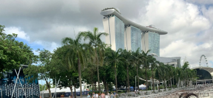
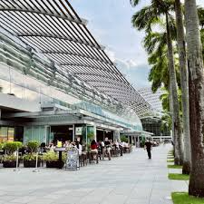 

## Post-fieldwork
### Contents:
- Representing and Analysing the Data Collected
- Concluding the Hypothesis
- Evaluating the Methodology
- Implications of the Research

### Data Collection Overview
In the whole survey, we attained a total of 30 responses, and is a large enough sample size to make an effective 
analysis on public opinion. 

## Data Analysis
### Question 1 - What attracted you to Singapore?   
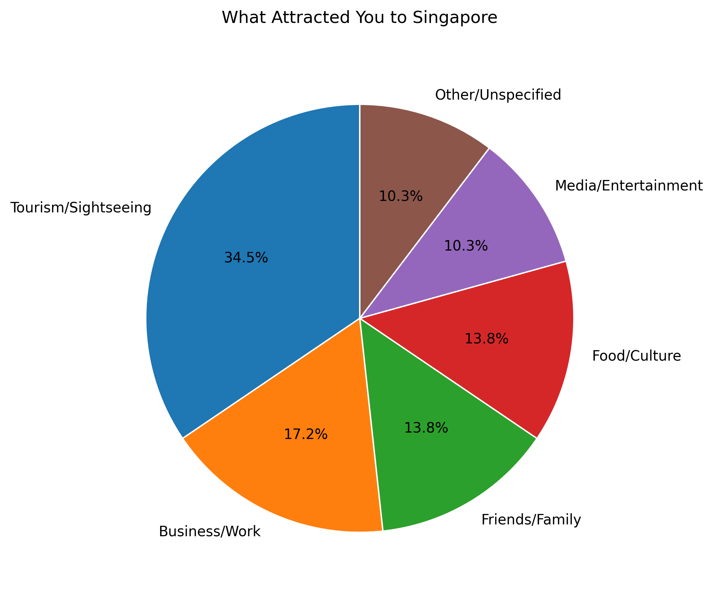
Although Question 1 is more open-ended, we observed a trend and that they could be classified and grouped together.

As shown in the graph, Tourism/Sightseeing is the most cited reason, showing that Singapore is very popular amongst
tourists for its environment and tourist services. The second-highest ranking, Business/ Work, suggests that Singapore, 
MBS areas is a very popular location for business activities too, apart from it being a tourist destination. This could
also be because it is relatively close to the CBD area where many international companies have their offices located. 
The cultural and social appeal of Singapore is also a significant pull factor that incentivises tourists to come to 
Singapore. 

From the above observations, we can find out more about their purpose in Singapore, and therefore tell if they just
came to MBS specifically for its tourist destinations or just because it is convenient. In this case, the ratio of the 
number of people at have chosen tourism/leisure to others (16:14) shows that the people came to MBS specifically for its
awesome tourist destinations. In one of the responses, it said that one came to Singapore after watching live streams by
a popular influencer online. This shows that the tourist was very impressed by the Singaporean culture and tourist 
 activities offered by MBS.

### Question 2 - What is your purpose of visit?
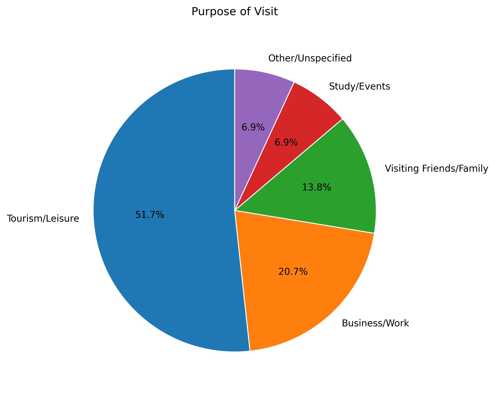

With Tourism/Leisure making up half of the responses, this shows that the tourists are mainly drawn to MBS for its 
entertainment activities. The second-highest ranking was Business/Work, which only makes up 20.7% of the total 
response, with significantly fewer responses in Study/Events and Visiting Friends/Family. This shows that the tourists
came to MBS for its entertainment activities, and not for their work.

### Question 3 - How often do you visit MBS Promenade?
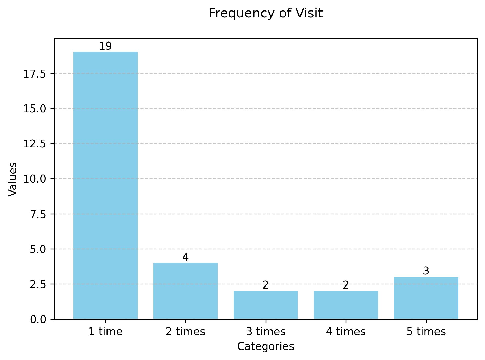

The graph reveals that most visits to MBS occur only once, consistent with tourist behaviour. This aligns with prior 
findings that tourists are predominantly attracted to MBS for entertainment—a pattern further supported by the low 
frequency of repeat visits, which suggests minimal engagement beyond one-time leisure activities.

### Question 4 - What is your main reason for visiting?
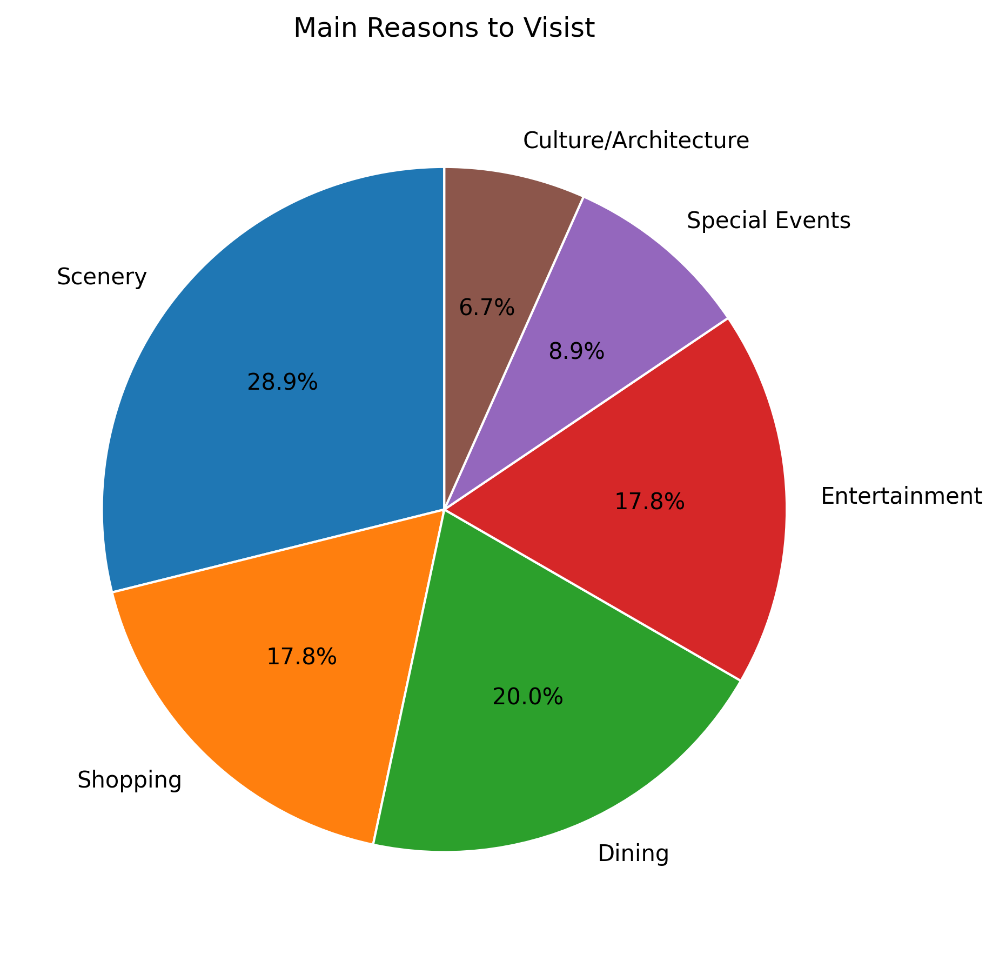

After finding out more about what the tourists are attracted by when visiting MBS, we can find out more about which 
specific sector of the Leisure/Entertainment sector they are drawn to. This graph shows a relatively equal distribution
of responses, with Scenery, Dining, Shopping, Entertainment and Special Events in their respective rankings from 
highest to lowest. It comes to no surprise that Scenery ranks first, as MBS has a good global reputation of its view 
of the Bay, showing Singapore's cityscape. The next highest ranking is the Dining sector, which shows that the food in 
the MBS area is well recognised by foreign tourists. 

### Question 5 - How satisfied are you with the facilities at MBS Promenade?
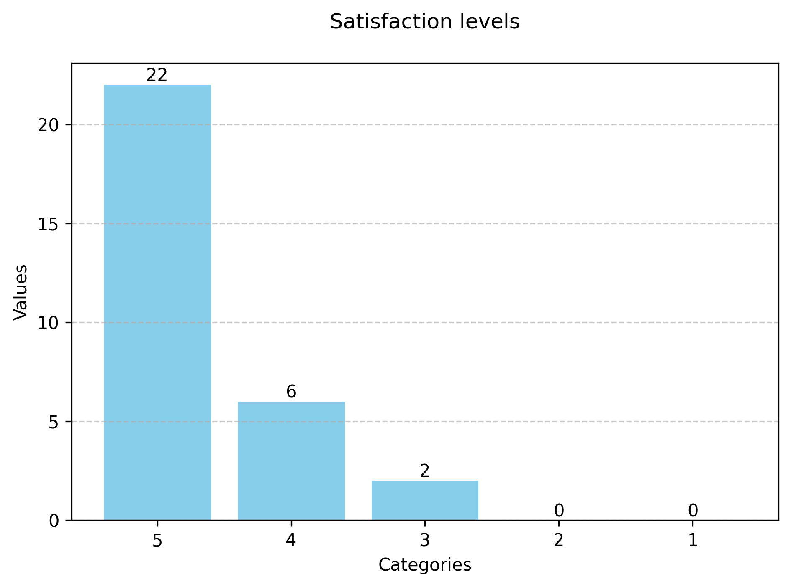

We would also like to find out more about how satisfied the tourists are with the facilities at MBS Promenade. The graph
shows all the responses in the range of 3 to 5, showing that the tourists are mostly very satisfied with the facilities 
located in the MBS area. This would tell us more about the experience of the tourists when visiting MBS.

### Question 6 - Why do you feel this way?
This question is non-compulsory and more open-ended. Therefore, it is quite hard to categorise the responses based on 
their opinions. We would be looking into some interesting responses.

_"This is one of Singapore’s more famous landmarks, but it is too overrated"_<br>
_"Very clean and modern, like being in the future"_<br>
_"It’s nice but it’s too expensive"_<br>
A similarity observed in the responses is that the tourists are that they stated that MBS is very clean and popular
amongst tourists. However, the were also mentions that the place was very expensive and over exaggerated. This shows
that MBS is not very friendly to the not so privileged tourists and that it might not be meeting the expectations of 
some tourists, possibly be because of the overly positive portrayal of the place online.

### Question 7 - How would you rate the crowd levels?
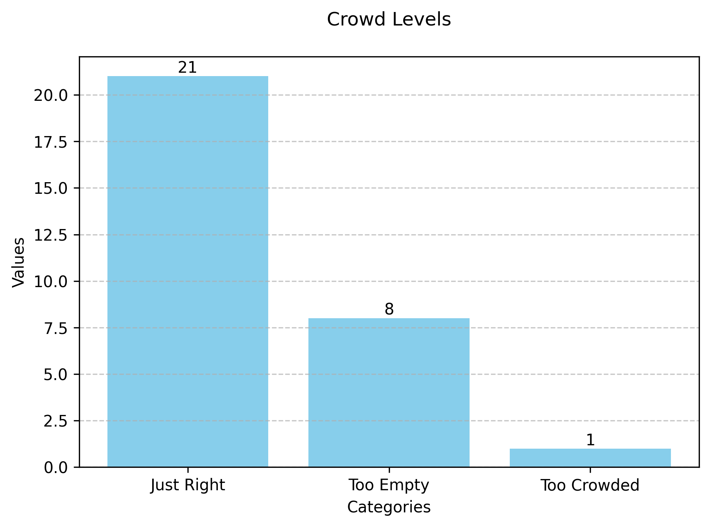
Learning more about the croud levels in MBS would tell us more about the satisfaction about the comfortability of those
that visited MBS. We can also get an idea of their expectations on MBS. According to the graph, most people choose that
it was just right and rather spacious while only 9 choose that they were not satisfied. Of which, 8 choose too empty
this maybe because of the online videos and advertisement showing the crowds of people in public holidays, making people
think that it is always like this. Overall, it shows that people are satisfied with the amount of people.

### Question 8 - Are you a visitor or a tourist?
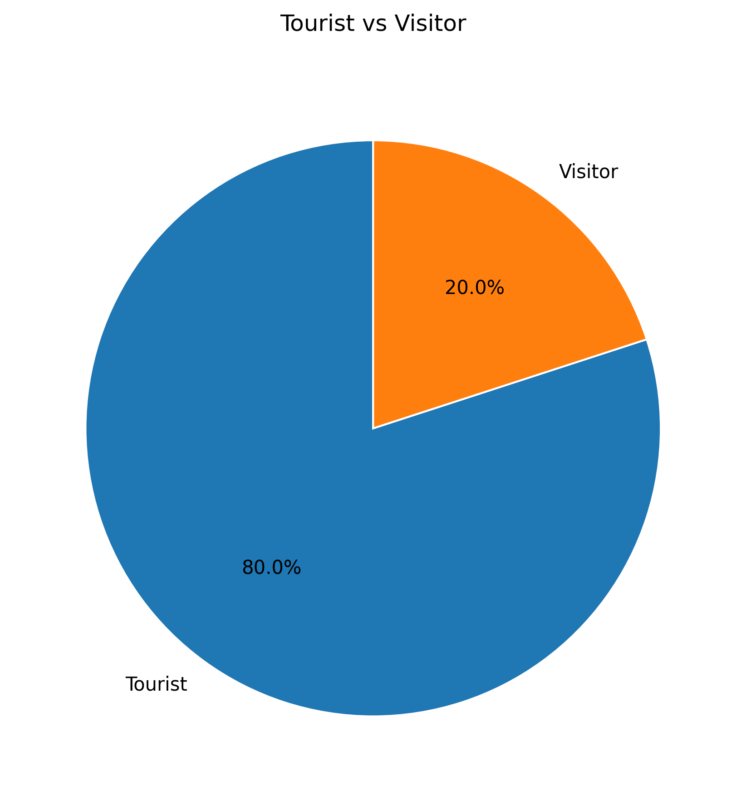
We want to know whether those who came are local or not. So that we could figure out if the place would be a more 
popular destination for foreigners or locals. According to the graph, they were mostly tourists.

### Question 9 - What is your yearly income level?
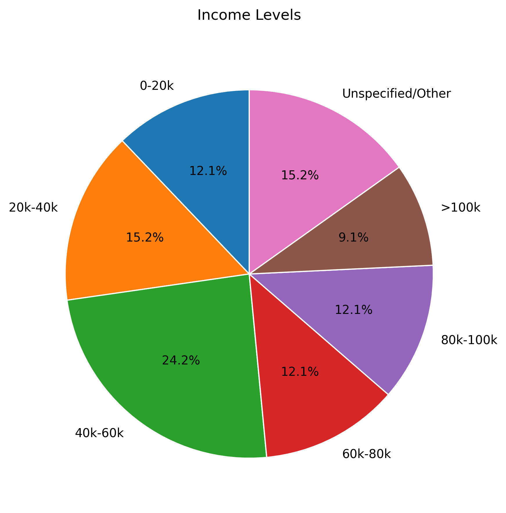
We also want to know more about the income levels of those people that come to MBS.
As shown in one of the above questions, someone did mention that MBS was rather expensive and not very affordable.
Therefore, we wanted to see if MBS was considered too expensive for many by comparing their responses with their 
previous responses. We found that MBS is not very affordable and maybe that was why noone really visited twice.

### Question 10 - What do you enjoy most at MBS Promenade?
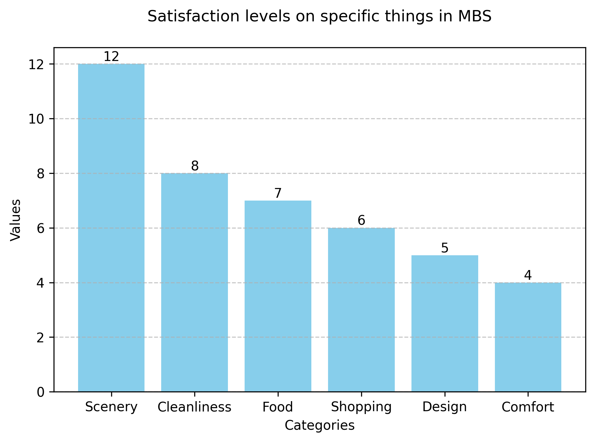
Well as the last question of our questionnaire, we observed a pattern too on the valid responses.
So I classified them to make them easier to analyse. The people that visited MBS was most satisfied with the scenery 
and cleanliness which resonates with the conclusions made earlier. 

## Post-fieldwork 
### Contents:
- Concluding the Hypothesis
- Evaluating the Methodology
- Implications of the Research

### Concluding the Hypothesis
According to our results and after our analysis, more than ⅓ of the visitors who visited MBS Promenade stated that the main reason for their visit is sightseeing of attractions, thus our hypothesis is somewhat accurate. I think more data would need to be collected until the majority is reached. Although this reason has the most respondents, I think it would need to be majority for our group to conclude that visitors primary reason for visiting MBS Promenade is for sightseeing of attractions.

### Evaluating the Methodology
I think our data has reliability issues, as we did not have enough responses to properly conclude. The responses on that day may not represent the responses of other tourists, making it less accurate and less reliable. I think the data would be more reliable if there is a greater number of interview sites and interviews completed over a larger number of dates. Doing this, we can get more responses, allowing us to analyse more responses, making our data more reliable and accurate.

### Implications of the Research
Not all tourists come to MBS Promenade for the attractions. Some people went there for business, friends and events rather than attractions. This implies that as a country, Singapore isn’t just a tourist attraction, but a place for networking, job or study opportunities, and just a place for anyone and everyone to enjoy. The research shows that MBS Promenade is a place not just for fun, but also for other events. 

-----------------------------------------------------
Citing:
[1] https://gemini.google.com
```json
{
  "model": "Gemini 2.0 Flash",
  "messages": [
    {"role": "user", "content": "Who do Tourists visit Singapore Marina bay Sands"},
    {"role": "assistant", "content": "Marina Bay Sands is a major tourist draw in Singapore, and for good reason. Here's a breakdown of why it attracts so many visitors:\n\n* **Iconic Architecture and Views:**\n    * The unique design of the building, especially the SkyPark and infinity pool, is instantly recognizable and provides stunning panoramic views of Singapore's skyline.\n    * The SkyPark Observation Deck offers those breathtaking views to all visitors.\n* **Luxury and Entertainment:**\n    * It's a hub for luxury shopping at The Shoppes at Marina Bay Sands, featuring high-end brands.\n    * It boasts world-class dining experiences with restaurants by celebrity chefs.\n    * It offers entertainment options, including a casino and theater shows.\n* **Unique Attractions:**\n    * The infinity pool is a major draw, offering a one-of-a-kind swimming experience (though it's reserved for hotel guests).\n    * The ArtScience Museum provides engaging and interactive exhibits.\n    * The Spectra light and water show is a free and captivating nightly attraction.\n* **Location:**\n    * Its location in the heart of Marina Bay makes it easily accessible and close to other popular attractions like Gardens by the Bay.\n\nIn essence, Marina Bay Sands offers a blend of luxury, entertainment, and stunning visuals, making it a must-visit destination for tourists in Singapore.\n"}
  ]
}
```
[2]
